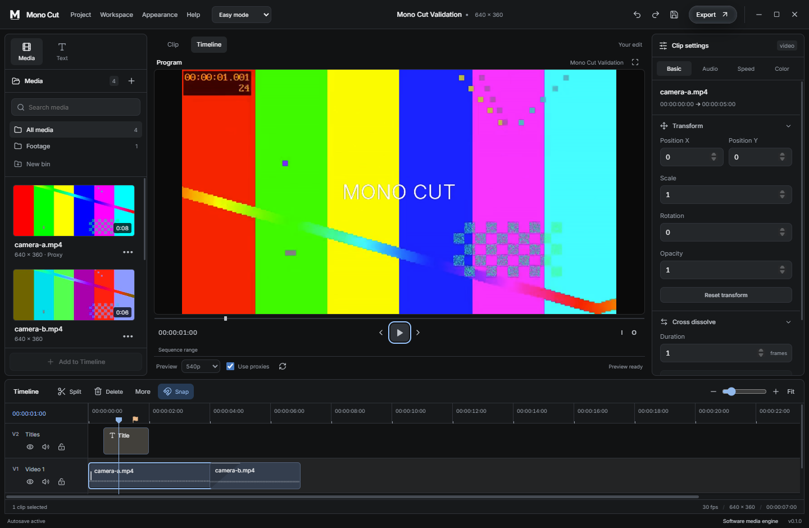
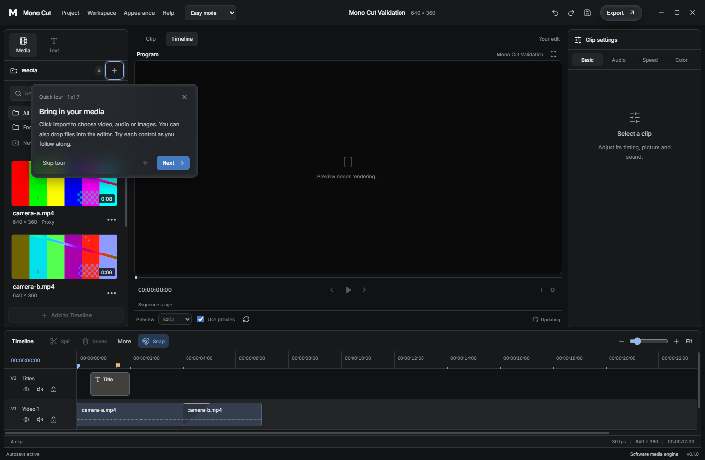
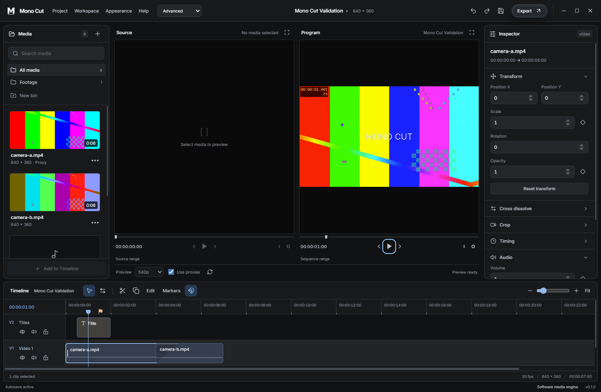
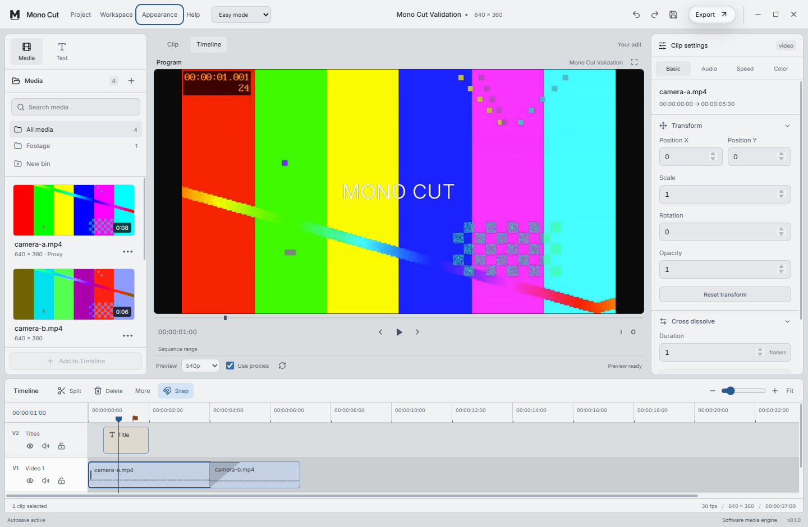

# Native editor screenshots

These images were captured from the Windows desktop application during the
earlier 0.1.0 native workflow validation on 2026-10-08, using generated test media. They show
Easy mode, its tooltip tutorial, Advanced mode and the light theme. The subsequent
source timing, envelope and preview scheduling corrections did not redesign
these panels. They are earlier UI captures, not evidence of a fresh installer
launch after those corrections. They do not show the 0.1.2 keyboard target cue
or prove its runtime behavior. No personal footage or local paths are shown.

## Easy mode

## Tooltip tutorial

## Advanced mode

## Light appearance

